# ARCHITECTURE.md — Project ANSER Brain Module

> **Audit Date:** 2026-05-08  
> **Auditors:** @qa (Gemini 3.1 Pro), @mentor (Claude Opus 4.6)  
> **Scope:** Every `.py` file in `src/`, `offline_training/`, `tests/`, and `launch_demo.py`

---

## 1. Code Quality Scorecard (@qa)

| Criterion | Score | Notes |
|---|---|---|
| **Separation of Concerns** | 7/10 | Good layering (agents → engine → core). However, `server.py` has grown into a 470-line monolith containing routing logic, webhook dispatch, inline imports, and a 25-line comment block debating sync-vs-async semantics. The `process_chat` closure captures `request`, `req`, `user_msg`, `task_id` from enclosing scope — this works but is fragile. |
| **Pydantic Coverage** | 4/10 | `schemas.py` defines `InvoicePayload`, `RetailChatResponse`, `ProductExtraction`, but only `InvoicePayload` is actually consumed (in the FINANCIAL route). `RetailChatResponse` and `ProductExtraction` are dead code. The `/upload`, `/ocr`, and `/health` endpoints still return raw dicts. |
| **Asynchronous Safety** | 5/10 | `process_chat()` is a synchronous closure dispatched via `BackgroundTasks`. Inside it, `fire_webhook()` is an async function invoked via `asyncio.get_running_loop()` / `asyncio.run()`. In a BackgroundTask thread, there is *no* running loop, so it always falls to `asyncio.run()`. This is safe *only if* no other coroutine is using `HttpClientPool._client` concurrently — which is unguarded. |
| **Error Handling** | 7/10 | Strong in `server.py` (try/except on all endpoints, explicit HTTPException re-raise). Weak in `knowledge.py` (bare `except Exception` prints to stdout instead of logging). `training.py` uses mock data and never actually calls the DeepSeek API. |

**Overall: 5.75 / 10** — Functional but carrying significant technical debt.

---

## 2. System Dependency Graph (@engineer)

```mermaid
flowchart TD
    subgraph "Client Layer"
        A["HTTP Client / Body Module"]
    end

    subgraph "API Gateway: src/server.py"
        B["FastAPI App + Lifespan"]
        B1["Middleware: Request ID"]
        B2["Auth: require_api_token"]
        B3["POST /chat"]
        B4["POST /upload"]
        B5["POST /ocr"]
        B6["GET /health"]
        B7["GET /api/v1/task/{task_id}"]
    end

    subgraph "Validation Layer"
        C1["schemas.py: InvoicePayload"]
        C2["json_repair: repair_json"]
    end

    subgraph "Agent Layer: src/agents/"
        D1["ManagerAgent: SemanticRouter + Consult"]
        D2["CoderAgent: JSON Workflow Gen"]
        D3["VisionAgent: Florence-2 OCR"]
        D4["ResearcherAgent: DuckDuckGo"]
        D5["BaseAgent: generate proxy"]
    end

    subgraph "Core Engine: src/core/"
        E1["ModelEngine: vLLM / LOCAL Mock"]
        E2["TaskRegistry: bounded, thread-safe"]
        E3["background_worker"]
    end

    subgraph "Deterministic Tools"
        F1["MCPServer.calculate_vat"]
        F2["MCPServer.validate_invoice_total"]
    end

    subgraph "Knowledge and RAG: src/core/knowledge.py"
        G1["ChromaDB Dense Retrieval"]
        G2["BM25Okapi Lexical Search"]
        G3["CrossEncoder Reranker"]
        G4["underthesea word_tokenize"]
    end

    subgraph "IO and Infra"
        H1["HttpClientPool: httpx.AsyncClient singleton"]
        H2["Webhook Dispatcher"]
        H3["MemoryManager: SQLAlchemy + Neon DB"]
        H4["Config: Model IDs, DB URL, vLLM params"]
    end

    subgraph "Offline Pipeline: offline_training/"
        I1["legal_miner.py: Firecrawl scraper"]
        I2["training.py: DeepSeek-R1 distillation"]
    end

    subgraph "Monitoring"
        J1["launch_demo.py: VRAM daemon thread"]
        J2["ngrok tunnel"]
    end

    A -->|"POST /chat"| B3
    A -->|"POST /upload"| B4
    A -->|"POST /ocr"| B5
    A -->|"GET /health"| B6
    A -->|"GET /task/id"| B7

    B3 --> B1 --> B2
    B3 -->|"BackgroundTasks.add_task"| E3
    E3 -->|"handler_func=process_chat"| D1
    D1 -->|"route=TECHNICAL"| D2
    D1 -->|"route=RETRIEVAL"| G1
    D1 -->|"route=FINANCIAL"| C1
    C1 -->|"Pydantic validated"| F2
    F2 --> F1
    C1 -->|"validation failed"| C2
    D1 -->|"route=GENERAL"| E1

    G1 --> G3
    G2 --> G3
    G4 --> G1
    G4 --> G2

    E3 -->|"on completion"| H2
    H2 --> H1
    H1 -->|"POST to BODY_CALLBACK_URL"| A

    B4 --> D3
    B5 --> D3
    D5 --> E1

    E1 -->|"ENV=LOCAL"| E1
    E1 -->|"ENV=COLAB"| H4

    B7 --> E2

    I1 --> H1
    I2 --> H1

    J1 -->|"torch.cuda.memory_allocated"| J1
```

---

## 3. File Manifest (@devops)

### `src/server.py` — FastAPI application entry point
- **Purpose:** Defines all HTTP endpoints, CORS, auth middleware, RuntimeState lazy-loading, and the `process_chat` background task closure.
- **Inputs:** HTTP requests (JSON body, file uploads, headers).
- **Outputs:** JSON responses, background task IDs, webhook POSTs.

### `src/core/engine.py` — Model Engine
- **Purpose:** Singleton `ModelEngine` with ENV-aware initialization. Hosts `TaskRegistry` and `background_worker`.
- **Inputs:** `os.getenv("ENV")`, prompts from agents.
- **Outputs:** Generated text (mock JSON or vLLM output), task status updates.

### `src/core/schemas.py` — Pydantic Schemas
- **Purpose:** Pydantic V2 models for strict payload validation.
- **Inputs:** Raw dicts from `json_repair`.
- **Outputs:** Validated `InvoicePayload`, `RetailChatResponse`, `ProductExtraction` objects.

### `src/core/mcp_server.py` — Deterministic Tax Calculator
- **Purpose:** Vietnamese tax calculation per Decree 72/2024. Zero LLM involvement.
- **Inputs:** `base_price`, `items[]`, `stated_total`.
- **Outputs:** VAT breakdown dicts with `is_valid` flags.

### `src/core/knowledge.py` — Hybrid RAG Engine
- **Purpose:** ChromaDB for dense vectors, BM25 for lexical exact-match, CrossEncoder for reranking. Uses `underthesea` for Vietnamese tokenization.
- **Inputs:** Query strings, document files (PDF, DOCX, TXT).
- **Outputs:** Top-K reranked document chunks as a formatted string.

### `src/core/utils.py` — HTTP Client Pool
- **Purpose:** `HttpClientPool` singleton for connection reuse.
- **Inputs:** None (class-level singleton).
- **Outputs:** A shared `httpx.AsyncClient` instance.

### `src/core/config.py` — Configuration
- **Purpose:** Centralized configuration. Model IDs, DB URL parsing, vLLM memory allocation params.
- **Inputs:** `os.getenv("DATABASE_URL")`.
- **Outputs:** Config object consumed by `ModelEngine` and `MemoryManager`.

### `src/core/memory.py` — Persistence Layer
- **Purpose:** SQLAlchemy-backed persistence. Chat sessions, messages, attachments, workflows.
- **Inputs:** `user_id`, `store_id`, SQL queries.
- **Outputs:** Context strings, store details, workflow IDs.

### `src/core/prompts.py` — Prompt Templates
- **Purpose:** System prompt templates for the Qwen chat format.
- **Inputs:** None (static strings).
- **Outputs:** Prompt templates consumed by agents.

### `src/core/tools.py` — Retail Utilities
- **Purpose:** Safe math evaluator (`ast.parse`), strategic weather+market forecasts.
- **Inputs:** Math expressions, store GPS coordinates.
- **Outputs:** Calculation results, forecast reports.

### `src/core/external_data.py` — External APIs
- **Purpose:** Open-Meteo weather, DuckDuckGo price checks.
- **Inputs:** Lat/lon coordinates, product names.
- **Outputs:** Weather summaries, competitor price snippets.

### `src/core/integrations.py` — Workflow Deployer
- **Purpose:** Validates/repairs JSON blueprints and saves to DB + filesystem.
- **Inputs:** Blueprint JSON, store ID, workflow name.
- **Outputs:** Workflow ID, saved `.json` file path.

### `src/core/agent_middleware.py` — Tool Definitions
- **Purpose:** Provides available workflow tool definitions to CoderAgent.
- **Inputs:** None.
- **Outputs:** Hardcoded tool description string.

### `src/core/context.py` — Login Resolver
- **Purpose:** Maps `user_id` → active store context.
- **Inputs:** `user_id`, `MemoryManager`.
- **Outputs:** Status (`READY`/`AMBIGUOUS`/`EMPTY`) + context string.

### `src/core/saas_api.py` — Database Queries
- **Purpose:** Product lookup, sales reports, and price updates.
- **Inputs:** Product names, workspace IDs.
- **Outputs:** Product lists, revenue summaries.

### `src/agents/base.py` — Agent Base Class
- **Purpose:** Maps agent `.generate()` calls to `ModelEngine.generate_text()`.

### `src/agents/manager.py` — Manager Agent
- **Purpose:** Semantic router (cosine similarity) + planning/consulting prompts.

### `src/agents/coder.py` — Coder Agent
- **Purpose:** Generates JSON workflow blueprints from plans.

### `src/agents/vision.py` — Vision Agent
- **Purpose:** Florence-2 image analysis (captioning + OCR).

### `src/agents/researcher.py` — Researcher Agent
- **Purpose:** DuckDuckGo search + LLM summarization.

### `src/evaluate_system.py` — Batch Evaluation Suite
- **Purpose:** Runs test cases through the full pipeline and grades via DeepSeek API.

### `launch_demo.py` — Entry Point
- **Purpose:** Sets up PYTHONPATH, ngrok, VRAM monitor, and launches Uvicorn.

### `offline_training/legal_miner.py` — Legal Scraper
- **Purpose:** Async paginated scraper for Vietnamese legal documents.

### `offline_training/training.py` — Distillation Script
- **Purpose:** Captures DeepSeek-R1 reasoning chains for fine-tuning.

### Tests: `test_server.py`, `test_server_basics.py`, `test_memory_contracts.py`, `test_tools.py`
- **Purpose:** Integration and unit tests covering endpoints, auth, memory contracts, and safe math.

---

## 4. Vulnerability Register

| ID | Severity | Location | Description | Status |
|---|---|---|---|---|
| V-001 | RESOLVED | `engine.py` | `TASK_REGISTRY` hardened with `threading.Lock`, max_size=1000, TTL eviction. | ✅ Fixed |
| V-002 | RESOLVED | `server.py` | FINANCIAL route default `resp` initialized to error message. | ✅ Fixed |
| V-003 | RESOLVED | `launch_demo.py` | Duplicate imports removed. | ✅ Fixed |
| V-004 | RESOLVED | `training.py` | Dead `HttpClientPool` client reference removed. | ✅ Fixed |
| V-005 | RESOLVED | `server.py` | `asynccontextmanager` import moved to file top. | ✅ Fixed |
